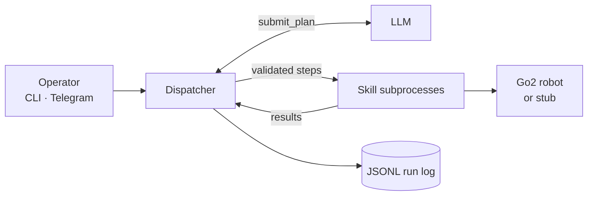

# go2-dispatcher

[](https://github.com/ShalomPrinz/go2-dispatcher/actions/workflows/tests.yml)

[](https://docs.astral.sh/uv/)
[](https://docs.astral.sh/ruff/)

**Natural-language control for the Unitree Go2 EDU quadruped.** Tell the robot what to do in plain words; an LLM plans it, the dispatcher validates and runs it, and every task is logged as research data.

```text
you  ▸ turn left 90 degrees, then tell me if you see a chair
go2  ▸ turned left 90°. Yes, a chair is about 1.8 m ahead.
```

## How it works



1. **Plan.** The LLM answers with a plan of skill calls through a single `submit_plan` tool, with explicit stop-and-report points.
2. **Validate.** The dispatcher checks every plan against the skill catalog, parameter bounds and safety budgets before anything moves.
3. **Execute.** Each step runs as an isolated subprocess against the real robot (Unitree SDK over DDS, no ROS) or a stub.
4. **Replan.** Results go back to the LLM until it reports `DONE` or `ABORT`.
5. **Log.** Each task writes a complete JSONL record: tokens, latency, replanning, outcomes.

## Highlights

- **Up-front planning** with a configurable horizon: one-step, batch or full-plan behaviour on one code path.
- **Safety first:** stop word, step timeouts, task time limit, motion budget, single-instance lock. A stub backend is the default.
- **Pluggable skills** defined by `SKILL.md` files (`walk`, `turn`, `sit`, `stretch`, `detect_object`); whole skill sets swap via config.
- **Reproducible runs:** fixed prompts and a registry hash keep runs comparable across a study.

## Quick start

```bash
uv sync                                                      # stub mode, no robot needed
cp config.example.toml config.toml && cp .env.example .env   # set ANTHROPIC_API_KEY in .env
uv run go2 catalog                                           # inspect skills and tool schema (no key needed)
uv run go2 run "turn left 90 degrees, then tell me if you see a chair"
uv run pytest -q
```

On the robot's lab machine: `uv sync --extra robot --extra vision` ([setup](docs/setup.md)). Run the real backend only with a person at the robot and the e-stop in reach ([safety](docs/safety.md)).

## Documentation

| | |
|---|---|
| [Project](docs/project.md) | Goals and the research study |
| [Architecture](docs/architecture.md) | Components, data flow, design decisions |
| [Setup](docs/setup.md) · [Running](docs/running.md) | Install and operate, CLI and Telegram |
| [Safety](docs/safety.md) | Everything that limits or stops the robot |
| [All docs](docs/README.md) | Full index |

## About

A capstone research project at Bar-Ilan University studying how skill-library granularity affects LLM dispatcher load and operator trust on a real quadruped.
